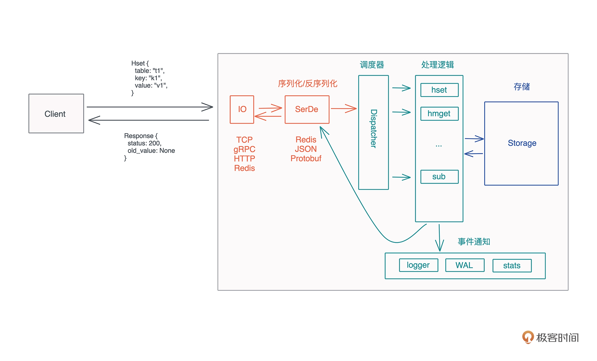

# Key Value Server
- support in-memory and redb storage
- support hget, hset, hexist, hdel command

# Architecture diagram

# Run and test
- `cargo run` to start the server
- `cargo run --example client` to start the client
